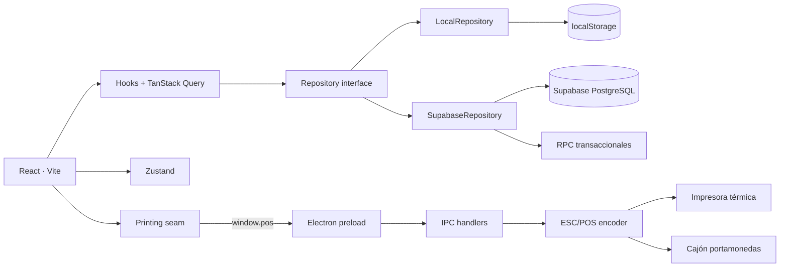
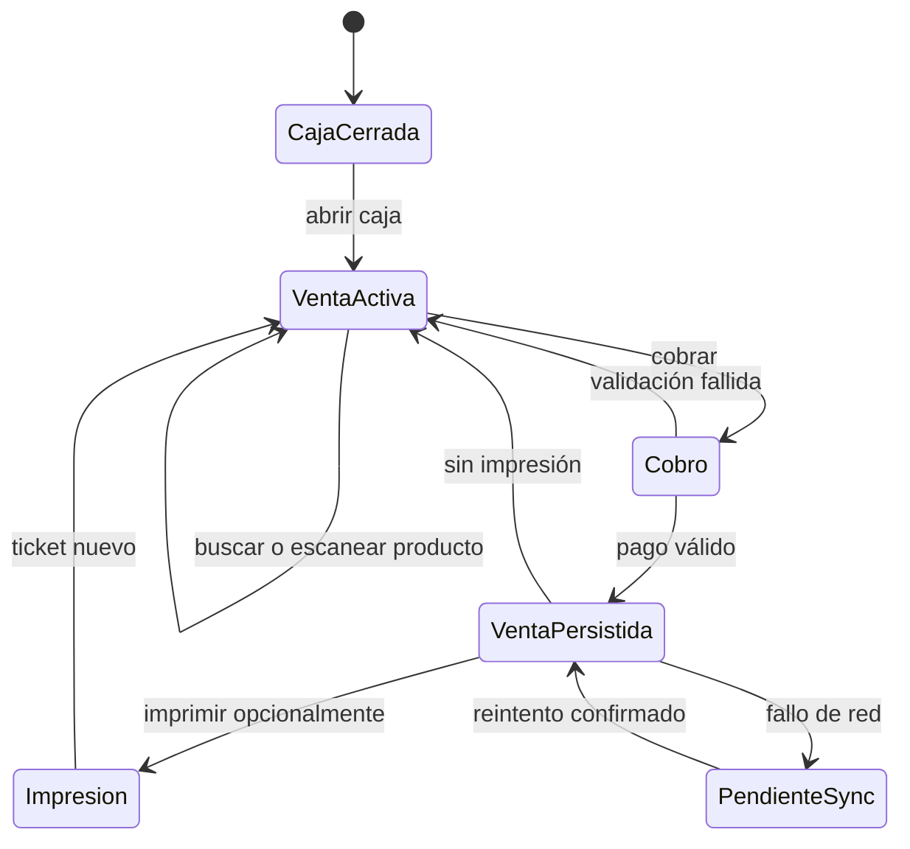

# Aurora TPV

**Terminal de punto de venta híbrido para retail, con dominio desacoplado, persistencia local/Supabase e integración de hardware ESC/POS mediante Electron utilizado en más de 2 comercios físicos reales en Madrid**

Aurora TPV cubre el ciclo operativo de una tienda de mostrador: catálogo, venta táctil, cobro, caja, clientes, tickets, informes, auditoría, usuarios e impresión térmica. La solución puede ejecutarse inmediatamente en modo local o conectarse a PostgreSQL/Supabase para trabajar con una fuente de datos centralizada.

> Estado: solución funcional y correctamente construida para operación retail real. La arquitectura, los flujos de caja y la integración con hardware fueron diseñados a medida a partir de las necesidades de negocios físicos de Madrid.

## Diseñado para comercio físico real

Aurora TPV no nace como una plantilla genérica: fue concebido a medida para resolver la operativa diaria de **Aroma Style Home**, comercio especializado situado en la calle Hermosilla 62 de Madrid, y de **FotoClick**, negocio madrileño dedicado a fotografía, revelado, impresión, marcos y productos personalizados.

El producto traduce necesidades de mostrador reales a una plataforma única: ventas rápidas, catálogo heterogéneo, códigos de barras, clientes, encargos, pagos mixtos, tickets regalo, cierres de caja, históricos, impresión térmica y control operativo. Su diseño permite atender tanto un comercio de aromas, decoración y regalo como un establecimiento fotográfico con servicios y productos de naturalezas muy distintas.

La solución está pensada para reducir tiempos de atención, eliminar tareas manuales repetitivas y ofrecer a responsables y empleados una visión consistente de cada venta. El modo local permite continuidad inmediata en el terminal y la integración con Supabase habilita centralización, trazabilidad y evolución multiusuario.

Negocios de referencia:

- [Aroma Style Home — establecimiento de calle Hermosilla 62](https://aromastylehome.com/aviso-legal)
- [FotoClick Madrid — comercio y estudio fotográfico](https://todoestaenmadrid.com/es/shops/fotoclick)

## Resumen funcional

| Área | Capacidades |
|---|---|
| Venta | Búsqueda, categorías, escáner USB, cantidades, descuentos, cambio de precio y ticket en tiempo real |
| Cobro | Efectivo, tarjeta y pago mixto, cálculo de cambio y validación de importes |
| Caja | Apertura, movimientos, cierre a ciegas, descuadre y resumen por método de pago |
| Catálogo | CRUD de productos, SKU, código de barras, categorías e historial de precios |
| Clientes | Registro, búsqueda, asignación a ventas y snapshot fiscal inmutable |
| Tickets | Original, copia, ticket regalo, anulación trazable y reimpresión |
| Hardware | Impresión ESC/POS 58/80 mm y apertura de cajón mediante comandos configurables |
| Informes | Facturación, ticket medio, top productos, categorías, pagos, margen estimado y CSV |
| Gobierno | Roles, permisos, RLS, auditoría operativa y eventos de impresión/cajón |
| Resiliencia | Cola temporal de ventas pendientes y reintento al recuperar conexión |

## Arquitectura



### Principios de diseño

- **Dominio puro:** cálculos monetarios, carrito, pagos, caja, ventas y permisos no dependen de React ni de Supabase.
- **Persistencia intercambiable:** la UI consume un contrato `Repository`; el modo local y el modo cloud implementan la misma superficie.
- **Operaciones críticas atómicas:** Supabase delega ventas y cierres en funciones PostgreSQL.
- **Hardware fuera del renderer:** React nunca accede directamente a `ipcRenderer`; utiliza una API limitada expuesta por `preload`.
- **Snapshots históricos:** líneas, precios y datos fiscales se copian en la venta para preservar su interpretación futura.
- **Trazabilidad:** impresión, cajón, anulaciones, movimientos y cambios sensibles generan eventos auditables.

## Flujo de venta



## Modos de ejecución

### Modo local

- no requiere backend ni cuenta;
- usa datos semilla y `localStorage`;
- permite probar el flujo completo de negocio en minutos;
- resulta idóneo para demostraciones y desarrollo de interfaz.

### Modo Supabase

- usa PostgreSQL como fuente oficial de verdad;
- incorpora autenticación de dispositivo y perfiles;
- comparte catálogo, ventas y caja entre sesiones;
- aplica RLS y RPC para las operaciones transaccionales;
- mantiene una bandeja local temporal cuando una venta no puede enviarse.

## Puesta en marcha rápida

### Requisitos

- Node.js 22.12 o superior.
- npm 10 o superior.
- Windows de 64 bits si se quiere utilizar Electron, impresión ESC/POS o el instalador NSIS.
- Proyecto Supabase opcional.

```bash
git clone <URL_DEL_REPOSITORIO>
cd TPV_TIENDA
npm install
npm run dev
```

Abre `http://localhost:5173`. Sin variables de Supabase la aplicación selecciona automáticamente el repositorio local.

### Comandos

| Comando | Resultado |
|---|---|
| `npm run dev` | Servidor Vite con recarga en caliente |
| `npm run test` | Suite Vitest en modo no interactivo |
| `npm run typecheck` | Verificación TypeScript del workspace |
| `npm run build` | Typecheck y bundle web de producción |
| `npm run preview` | Previsualización del bundle |
| `npm run app:dev` | Vite y Electron coordinados para desarrollo |
| `npm run app:start` | Build local y arranque del shell Electron |
| `npm run app:build` | Aplicación Windows desempaquetada |
| `npm run app:installer` | Instalador NSIS para Windows x64 |

## Configuración

Copia la plantilla y completa solo los valores necesarios:

```bash
copy .env.example .env
```

| Variable | Uso |
|---|---|
| `VITE_SUPABASE_URL` | URL pública del proyecto Supabase |
| `VITE_SUPABASE_ANON_KEY` | Clave pública protegida por RLS |
| `VITE_DATA_MODE` | `local`, `supabase` o `auto` |
| `VITE_DEVICE_EMAIL` | Cuenta de dispositivo solo para desarrollo local |
| `VITE_DEVICE_PASSWORD` | Contraseña de dispositivo; nunca en hosting público |
| `VITE_DEFAULT_OPERATOR` | Operador mostrado inicialmente |

En un despliegue web público, las credenciales de dispositivo deben quedar vacías. El shell Electron las lee desde `device.json`, almacenado en cada terminal.

## Base de datos Supabase

La ruta recomendada para un entorno nuevo es ejecutar `supabase/setup.sql`, que consolida esquema y datos semilla. Para evolución controlada están disponibles las migraciones individuales:

```text
0001  esquema inicial, perfiles, catálogo, ventas y caja
0002  plantilla de ticket e impresión
0003  anulaciones
0004  totales de cierre
0005  registro de clientes
0006  historial de precios
0007  retirada del stock del flujo operativo
0008  simplificación de devoluciones y métodos de pago
0009  modo fiscal y auditoría
0010  cliente asignado a venta
0011  impresión ESC/POS y cajón
0012  codificación de impresora
0013  ticket regalo
```

Entidades principales:

```text
auth.users 1──1 profiles ──> roles ──< role_permissions
categories 1──< products ──< sale_items >── sales
customers 1──< sales >──1 cash_sessions
sales 1──< payments
sales 1──< print_jobs
cash_sessions 1──< cash_movements
cash_sessions 1──< cash_drawer_events
audit_events
settings
```

Las RPC principales son:

- `process_sale(payload jsonb)`: persiste cabecera, líneas, pagos, numeración y auditoría como una unidad;
- `close_cash_session(...)`: calcula efectivo esperado, registra conteo y cierra la sesión.

## Reglas de negocio

- No se permite vender con la caja cerrada.
- Cantidades y precios deben ser positivos; los descuentos se acotan entre 0 y 100 %.
- Los importes se redondean a dos decimales en los límites del dominio.
- La suma de pagos debe cubrir exactamente el total, salvo efectivo entregado que produce cambio.
- La tarjeta se cobra por el importe exacto que le corresponde.
- El efectivo esperado considera fondo, ventas en efectivo, entradas y salidas.
- El cierre es a ciegas: el sistema revela el descuadre después del recuento.
- Las anulaciones no eliminan tickets; preservan estado, motivo, usuario y fecha.
- El snapshot de cliente evita que una edición posterior reescriba el histórico fiscal.

## Impresión ESC/POS y cajón

El shell Electron genera bytes ESC/POS sin introducir dependencias nativas en el renderer. Admite:

- perfiles de 58 y 80 mm;
- codificaciones configurables y tratamiento gráfico del símbolo euro;
- logo, cabecera, pie, desglose fiscal y política de cambios;
- corte de papel;
- apertura de cajón mediante pulso configurable;
- original, copia, prueba, cierre de caja y ticket regalo;
- transporte Windows y salida a archivo para diagnóstico;
- registro de trabajos y errores.

En navegador, el sistema utiliza la ruta de impresión disponible o informa de la ausencia de hardware. Las pruebas del encoder ESC/POS no requieren una impresora física.

## Distribución de escritorio y actualizaciones

La solución separa dos artefactos:

1. **Renderer web:** se publica en Vercel, Netlify, Cloudflare Pages u hosting estático.
2. **Shell Electron:** se instala una vez en el equipo de tienda y carga el renderer remoto.

Las actualizaciones de React, lógica de negocio y pantallas llegan con el siguiente despliegue web. Solo los cambios en Electron, IPC, impresión o configuración de dispositivo requieren un nuevo instalador. Si la URL remota no está disponible, el shell intenta cargar el bundle local incluido.

Consulta `docs/DESKTOP_CLOUD_DEPLOYMENT.md` para el procedimiento completo.

## Estructura del repositorio

```text
src/
├── components/              # UI reutilizable, layout y flujo POS
├── config/                  # Selección de entorno y modo de datos
├── data/
│   ├── local/               # Repository sobre localStorage
│   └── supabase/            # Repository cloud y cola pendiente
├── domain/                  # Reglas puras y modelos de negocio
├── hooks/                   # Orquestación de casos de uso
├── lib/                     # Scanner, impresión, formato y Supabase
├── pages/                   # Venta, caja, clientes, informes y ajustes
└── store/                   # Estado de sesión y carrito
electron/
├── escpos/                  # Encoder y pruebas de protocolo
├── ipc/                     # Frontera de mensajes
└── services/                # Impresora y cajón
supabase/
├── migrations/              # Evolución incremental
├── seed.sql                 # Datos de demostración
└── setup.sql                # Bootstrap consolidado
docs/
├── ARCHITECTURE.md
├── DESKTOP_CLOUD_DEPLOYMENT.md
└── VERIFACTU.md
```

## Calidad

```bash
npm test
npm run typecheck
npm run build
```

Línea base verificada:

- 10 archivos de prueba superados;
- 75 tests superados;
- TypeScript sin errores;
- build Vite de producción correcto;
- pruebas de dominio, repositorios, escáner, caja, clientes y ESC/POS.

El bundle actual emite una advertencia de tamaño superior a 500 kB para el chunk principal; el code-splitting por ruta queda como optimización de rendimiento, no como error funcional.

## Seguridad

- `.env*`, `device.json`, metadatos locales, builds e instaladores están fuera de Git.
- El contexto aislado de Electron expone solo `window.pos`, no `ipcRenderer` completo.
- La contraseña del terminal reside en el equipo, no en el renderer desplegado.
- Supabase mantiene RLS activa; cada implantación puede endurecer las políticas por rol según la organización y el número de terminales.
- Las operaciones sensibles se auditan y las anulaciones no destruyen el histórico.
- Las credenciales incluidas en `VITE_*` forman parte del bundle; nunca se debe introducir una `service_role` en variables Vite.

## Alcance fiscal

El proyecto implementa numeración, desglose de IVA, modo fiscal interno, snapshots y encadenamiento de control, pero **no afirma cumplimiento VERI*FACTU**. Faltan, entre otros, el formato exacto AEAT, la huella reglamentaria, QR oficial, envío y gestión de respuestas, subsanaciones y validación legal/fiscal.

La evaluación completa está documentada en `docs/VERIFACTU.md`.

## Evolución operativa

- La cola offline de Supabase cubre ventas pendientes, no todos los comandos operativos.
- La idempotencia server-side de reintentos debe reforzarse antes de operación distribuida intensiva.
- El fallback local no convierte Supabase en una base completamente offline.
- El soporte ESC/POS puede requerir ajustes por modelo, driver y code page.
- El despliegue productivo requiere políticas RLS específicas, backups y procedimientos fiscales.

## Casos de uso implementados

- venta táctil completa con efectivo, tarjeta o mixto;
- escaneo de códigos de barras con lector USB;
- apertura y cierre de caja con descuadre;
- alta de producto y trazabilidad de precio;
- alta y asignación de cliente;
- anulación y reimpresión de tickets;
- ticket regalo y cierre en ESC/POS;
- informes operativos y exportación CSV;
- auditoría filtrable de eventos;
- conmutación entre persistencia local y Supabase.

---

Aurora TPV es un producto de ingeniería retail diseñado desde la operativa de tienda física: una base tecnológica profesional, extensible y probada para coordinar venta, caja, cliente, trazabilidad e integración de hardware desde una única experiencia de trabajo.
